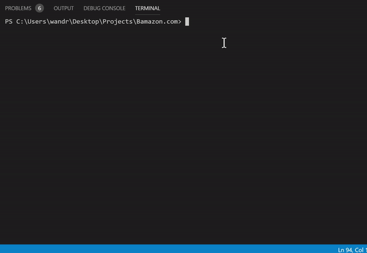
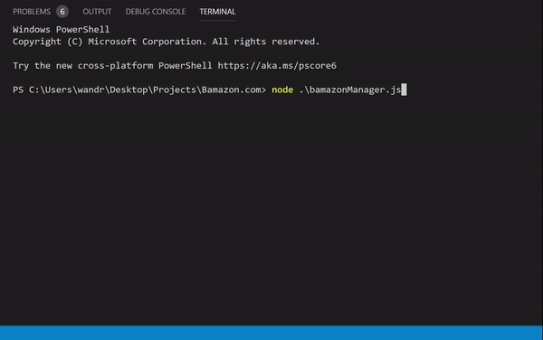

# Bamazon.com
## Overview

Bamazon is a CLI created using the NPM inquirer and mysql to allow the user to navigate through a small database of items similar to an Amazon.com database. Within the bamazonCustomer.js app, the user is a customer and can make purchases from the database. Here is  a demo of how it works.

The second app, bamazonManager.js allows the user to view the database, view items with low inventory, add new items to the inventory, and adjust the product's stock inventory. Here is a demo of how it works.  

The database for both apps was created using MySQL and the logic was run using Node.js. This CLI utilizes the inquirer and mysql NPM. 

## Installation 

Follow the steps below to run the Bamazon CLI in your own terminal:

1. Within your terminal clone [this](https://github.com/wandrew8/Bamazon.com.git) git repository.

2. Within your MySQL workbench, copy and run the SQL commands found in the bamazon.sql and seeds.sql files in the repository.

3. Run the bamazonCustomer.js file in your terminal and type the following to install the MySQL and Inquirer NPMs:

            npm install

4. Now you're ready to use the Bamazon CLI. Just use the arrow keys and enter to navigate through the Bamazon online database. Enjoy!

## Contact Me

 I'm Andrew Weiss. If you have any questions of suggestions you can contact me at my github account [wandrew8](https://github.com/wandrew8).
